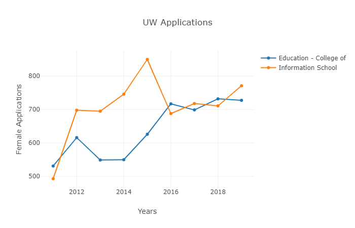
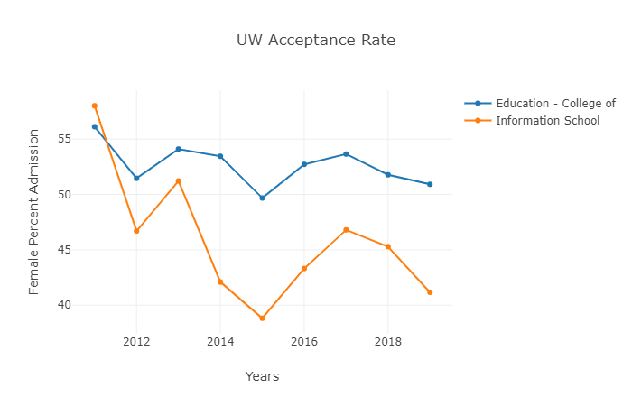

# Readme #
## Uw Admission Dash ## 

### by Martin Horst ### 

This repo supports an interactive, dashboard visualization for UW Admission Statistics through 2018, available here:
https://grad.uw.edu/wp-content/uploads/2019/06/admissions

Total Applicants and Acceptance Rates are implemented for now, with more useability upcoming for future commits.

Developed on Jupyter Notebook 4.1.1, choose to run either download the pdfs yourself or run everything from the batch script: 

```run_dash.bat _your_directory_``` 

NOTE: There may be dependencies that are necessary for implementation. Notably pandas, numpy, pypdf, etc. You can install them using the following commands: 

```pip install pandas```

```pip install numpy```

```pip install dash```

```pip install plotly```

```pip install sys```

```pip install glob```

```pip install jupyter-dash-plotly```

```pip install pyPDF2```

```pip install requests```


The following images show dashboard jpg pictures when Information and College of Education are selected for Female applicants
*Total Female Applicants to College of Education and Information School* 



*Acceptance Rate of Female Applicants to College of Education and Information School* 

